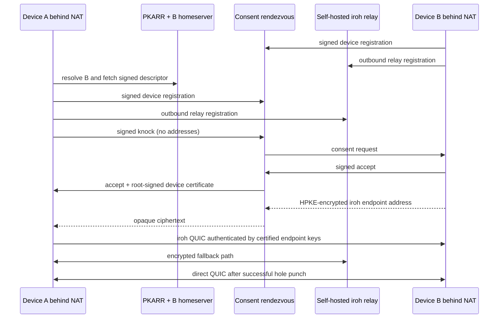

# pubky2pubky

pubky2pubky maps a Pubky identity to authenticated native iroh QUIC endpoints. Protocol v3 is an
additive, rendezvous-free design: PKARR locates the identity's unmodified homeserver, public
storage provides a root-signed device directory and short-lived device-signed relay locators, and
iroh supplies encrypted relay fallback plus direct UDP hole punching.

```text
Pubky ID -> PKARR -> homeserver -> signed v3 directory + locators -> iroh relay -> direct QUIC
```

V3 deliberately permits public contact. Reading an identity's public records reveals its device
and iroh endpoint identifiers and chosen relay; initiating iroh may reveal liveness and network
address candidates before any application message is accepted. Direct-capable callers must
explicitly acknowledge that disclosure. The current native v3 API is direct-with-relay-fallback;
it does not yet expose a peer-address-hiding relay-only mode, so privacy-sensitive identities
should retain v2's consent service. See [the v3 model](docs/v3.md) before integrating it.

The receiver still explicitly accepts an authenticated v3 Hello before an Ack is sent or the
`Peer` is exposed to application payload handlers. What v3 gives up is consent *before network
contact*, not consent before application payload processing. The transport may buffer bounded
encrypted input from a hostile peer before that decision.

Messages use one end-to-end encrypted iroh QUIC/TLS 1.3 connection on the relayed and direct paths;
path migration does not terminate encryption at the relay. Pubky signatures bind that QUIC
endpoint ID to the advertised identity. The homeserver and relay see metadata, never message
plaintext, and there is no v3 plaintext fallback. The reference never sends 0-RTT and disables
outbound TLS ticket reuse. Iroh 1.1 cannot disable every hostile encrypted, replayable early input
through its public server API; signed Hello replay checks remain mandatory, and no `Peer` reaches
application payload handlers before receiver acceptance.

V2 remains available and wire-compatible with existing v2 deployments. It uses a separate
consent-first WebSocket rendezvous and withholds the target address until acceptance. There is no
automatic downgrade between v3, v2, or the former WebRTC v1 protocol.

## V3 CLI flow

The compatibility-preserving executable is still named `hole-punchky` in this additive commit;
all new wire identifiers, storage paths, application defaults, and protocol text use
`pubky2pubky`. The CLI is a native integration probe, not a recovery-phrase UI.

Create a Pubky root plus v3 device and its durable locator-publisher state. Issuance creates new
files only; it will not replace an existing root or device:

```bash
cargo build -p hole-punchky
target/debug/hole-punchky v3-init \
  --device-id alice-laptop \
  --root-out alice.root.json \
  --device-out alice.device.json \
  --publisher-state-dir alice.publisher-state

target/debug/hole-punchky v3-export-certificate \
  --device alice.device.json \
  --out alice.certificate.json

target/debug/hole-punchky v3-directory \
  --root alice.root.json \
  --certificate alice.certificate.json \
  --generation 1 \
  --out alice.directory.json
```

Repeat for Bob. Sign both identities up with the existing `signup` command, then publish each
root-signed directory:

```bash
target/debug/hole-punchky v3-publish-directory \
  --root alice.root.json \
  --directory alice.directory.json
```

Add `--testnet` to signup, publication, resolution, listener, and dial commands when using the
Pubky development stack. Directory generation is offline monotonic state: record the next value
before publishing. Never guess a lower value after losing that state.

Start Bob's endpoint. Use one to four relay origins that the application trusts locally; the
published record can select only an exact configured origin. This command loads the device key and
publisher state, not Bob's root:

```bash
target/debug/hole-punchky v3-listen \
  --device bob.device.json \
  --state-dir bob.observed-state \
  --publisher-state-dir bob.publisher-state \
  --locator-out bob.locator.json \
  --iroh-relay https://relay.example/ \
  --acknowledge-pre-consent-network-exposure \
  --auto-accept --echo --once
```

For an interactive check, omit `--auto-accept`; the CLI shows the authenticated caller identity,
device, and application before asking. In another terminal, publish the locator while the listener
remains alive:

```bash
target/debug/hole-punchky v3-publish-locator \
  --root bob.root.json \
  --certificate bob.certificate.json \
  --locator bob.locator.json
```

The short publisher uses the root file only to obtain a development `PubkySession` and exits.
Library integrations instead pass an already-authorized, scoped session. The listener never needs
the root. Locators expire within 15 minutes; the probe exits when its locator expires instead of
pretending to remain reachable.

Dial Bob using only Bob's Pubky ID. Alice first writes a fresh locator and pauses; publish that file
from another terminal with `v3-publish-locator`, then return and press Enter. This lets Bob verify
Alice through Pubky as well:

```bash
target/debug/hole-punchky v3-dial \
  --device alice.device.json \
  --peer <bob-pubky-id> \
  --state-dir alice.observed-state \
  --publisher-state-dir alice.publisher-state \
  --locator-out alice.locator.json \
  --iroh-relay https://relay.example/ \
  --acknowledge-pre-consent-network-exposure
```

After publishing Alice's locator, press Enter at the first prompt. The CLI then reads the test
message as one UTF-8 stdin line, bounded to 65,536 bytes. It does not accept message plaintext in
an argv flag, so the message is not copied into shell history or the process list. The in-memory
input is zeroized after use, and received peer bytes are escaped before terminal display.

Both locator-producing commands allocate their sequence atomically from mode-`0600` state in a
mode-`0700` directory. They never accept a manually supplied counter. If publisher state is lost,
retire that certificate and issue a new device/control key; do not reinitialize the old key.

The relay must support v3 clients. The supplied Compose deployment is v2-specific because its
relay admission callback depends on v2 rendezvous presence. For v3, configure the official relay
with a shared token, explicit endpoint allowlist, or a separate v3 authorization service. Pass a
shared token only through `PUBKY2PUBKY_IROH_RELAY_TOKEN`, preferably injected by a local secret
manager. V3 intentionally has no `--relay-token` option, so the token cannot enter argv, shell
history, or ordinary process listings. It is bounded, validated as visible ASCII, never printed,
and never published in a locator. The historical v2 commands retain their existing option.

## Hole Punchky protocol v2 (compatibility)

Hole Punchky establishes an authenticated iroh QUIC stream between two native devices that initially know only each other's Pubky identity. Both devices may be behind NAT and firewalls. Pubky/PKARR supplies discovery and root identity, a small public rendezvous service obtains explicit consent, and iroh performs NAT traversal with a self-hosted relay fallback.

The target's addresses are not disclosed and no peer QUIC handshake starts before acceptance. After consent, the target sends one HPKE-encrypted iroh `EndpointAddr`. Iroh first gives the peers a reliable relay path, tries UDP hole punching, and moves QUIC to a direct path when the network permits it. Application bytes remain end-to-end encrypted on either path.



No `pubky-homeserver` fork is required. The unmodified homeserver stores one ordinary signed file:

```text
pubky://<identity>/pub/hole-punchky/v2/descriptor.json
```

See [architecture.md](docs/architecture.md) for the homeserver decision, [protocol.md](docs/protocol.md) for the normative protocol, and [threat-model.md](docs/threat-model.md) before operating it publicly.

## V2 implementation

- Pubky-root-signed device certificates with independent Ed25519 control-signing, X25519 HPKE, and Ed25519 iroh endpoint keys.
- Signed, expiring Pubky discovery descriptors and priority-ordered endpoint failover.
- Consent-first WebSocket rendezvous with replay defense, multi-device fan-out, first-responder binding, strict routing, expiry, quotas, and payload blindness.
- A single responder address signal, encrypted using RFC 9180 HPKE and bound to the responder certificate.
- Iroh 1.1 QUIC with QUIC address discovery, direct path migration, port mapping, self-hosted relay fallback, relay-only privacy mode, and path reporting.
- A session-bound QUIC stream hello/ack that rechecks Pubky identities, devices, application protocol, session UUID, and both certified iroh endpoint IDs.
- Relay admission for currently registered, root-delegated devices through the official iroh relay HTTP authorization hook.
- Length-delimited binary messages up to a configurable 16 MiB default.
- Health, public configuration, Prometheus metrics, Docker Compose, CLI, AsyncAPI, and OpenAPI surfaces.
- Cryptographic tamper tests, live WebSocket tests, direct QUIC tests, forced-relay tests, a two-NAT Linux namespace lab, container smoke tests, and Pubky testnet discovery tests.

## V2 quick local run

Rust 1.91+ and Docker Compose are required.

```bash
export HPK_RELAY_AUTH_SECRET="$(openssl rand -hex 32)"
docker compose -f deploy/docker-compose.yml up --build --detach --wait
# The local image creates a development CA for iroh QUIC address discovery.
docker compose -f deploy/docker-compose.yml cp iroh-relay:/etc/iroh-relay/relay-ca.crt /tmp/hole-punchky-relay-ca.crt
```

Create two identities in separate files:

```bash
cargo run -p hole-punchky -- init \
  --device-id alice-laptop \
  --root-out alice.root.json \
  --device-out alice.device.json

cargo run -p hole-punchky -- init \
  --device-id bob-phone \
  --root-out bob.root.json \
  --device-out bob.device.json
```

Listen as Bob. `--accept` is intentionally explicit and intended for tests or demos; a real application should show the knock details to a user or apply its own policy.

```bash
cargo run -p hole-punchky -- listen \
  --device bob.device.json \
  --rendezvous ws://127.0.0.1:8080/v2/ws \
  --iroh-relay http://127.0.0.1:3340 \
  --iroh-relay-ca /tmp/hole-punchky-relay-ca.crt \
  --allow-insecure-relay \
  --accept --echo --once
```

Dial with the Bob identity printed by `init`:

```bash
cargo run -p hole-punchky -- dial \
  --device alice.device.json \
  --peer <bob-z32-identity> \
  --rendezvous ws://127.0.0.1:8080/v2/ws \
  --iroh-relay http://127.0.0.1:3340 \
  --iroh-relay-ca /tmp/hole-punchky-relay-ca.crt \
  --allow-insecure-relay \
  --message hello
```

Plain `ws://` rendezvous and `http://` relay URLs are accepted only with a loopback hostname and explicit relay opt-in. Public deployments require `wss://` and `https://`.

The root key is a development fallback for signing. Applications should keep the Pubky root in Pubky Ring and provide a signer adapter for root-signed device certificates and descriptors; the rendezvous and QUIC client never need the root secret. The wire format already authenticates the root public key and signatures independently of where the signing operation runs.

## V2 Pubky discovery

Sign a descriptor for the rendezvous service:

```bash
cargo run -p hole-punchky -- descriptor \
  --root bob.root.json \
  --rendezvous wss://connect.example.com/v2/ws \
  --out bob.descriptor.json
```

The identity must have a homeserver account. Publish using the same root key:

```bash
cargo run -p hole-punchky -- publish \
  --root bob.root.json \
  --descriptor bob.descriptor.json
```

Pass `--testnet` to `signup`, `publish`, or discovery-based `dial` when using the local Pubky development environment. The relay URL is intentionally supplied to each running device rather than published in plaintext; the responder's current relay and direct coordinates arrive encrypted after consent.

## Test

```bash
./scripts/test-all.sh
```

Docker and privileged Linux network namespaces add the infrastructure tests:

```bash
HPK_RELAY_AUTH_SECRET="$(openssl rand -hex 32)" ./scripts/container-smoke.sh

sudo env \
  HPK_BIN="$PWD/target/release/hole-punchky" \
  HPK_RENDEZVOUS_CONNECT_IP=<reachable-ip> \
  ./scripts/nat-lab.sh
```

See [testing.md](docs/testing.md) for exact prerequisites and assertions.

## Workspace

- `hole-punchky-protocol`: signed discovery/control types and HPKE envelopes.
- `hole-punchky-rendezvous`: payload-blind consent and relay-admission sidecar.
- `hole-punchky-client`: Pubky resolver plus native iroh transport.
- `hole-punchky`: operational CLI.
- `deploy/iroh-relay.Dockerfile`: checksum-pinned official iroh relay 1.1 binary.

Licensed under the MIT License.
