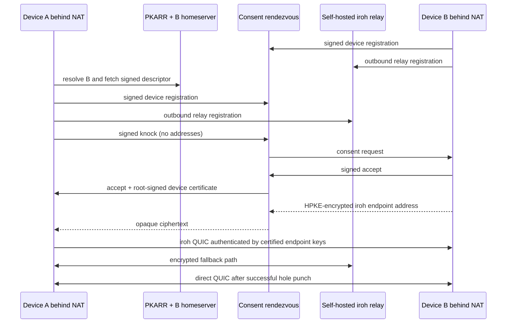

# Hole Punchky

Hole Punchky establishes an authenticated iroh QUIC stream between two native devices that initially know only each other's Pubky identity. Both devices may be behind NAT and firewalls. Pubky/PKARR supplies discovery and root identity, a small public rendezvous service obtains explicit consent, and iroh performs NAT traversal with a self-hosted relay fallback.

The target's addresses are not disclosed and no peer QUIC handshake starts before acceptance. After consent, the target sends one HPKE-encrypted iroh `EndpointAddr`. Iroh first gives the peers a reliable relay path, tries UDP hole punching, and moves QUIC to a direct path when the network permits it. Application bytes remain end-to-end encrypted on either path.



No `pubky-homeserver` fork is required. The unmodified homeserver stores one ordinary signed file:

```text
pubky://<identity>/pub/hole-punchky/v2/descriptor.json
```

See [architecture.md](docs/architecture.md) for the homeserver decision, [protocol.md](docs/protocol.md) for the normative protocol, and [threat-model.md](docs/threat-model.md) before operating it publicly.

## Implemented

- Pubky-root-signed device certificates with independent Ed25519 control-signing, X25519 HPKE, and Ed25519 iroh endpoint keys.
- Signed, expiring Pubky discovery descriptors and priority-ordered endpoint failover.
- Consent-first WebSocket rendezvous with replay defense, multi-device fan-out, first-responder binding, strict routing, expiry, quotas, and payload blindness.
- A single responder address signal, encrypted using RFC 9180 HPKE and bound to the responder certificate.
- Iroh 1.1 QUIC with QUIC address discovery, direct path migration, port mapping, self-hosted relay fallback, relay-only privacy mode, and path reporting.
- A session-bound QUIC stream hello/ack that rechecks Pubky identities, devices, application protocol, session UUID, and both certified iroh endpoint IDs.
- Relay admission for currently registered, root-delegated devices through the official iroh relay HTTP authorization hook.
- Length-delimited binary messages up to a configurable 16 MiB default.
- Health, public configuration, Prometheus metrics, Docker Compose, CLI, AsyncAPI, and OpenAPI surfaces.
- Cryptographic tamper tests, live WebSocket tests, direct QUIC tests, forced-relay tests, a two-NAT Linux namespace lab, container smoke tests, and Pubky testnet discovery tests.

## Quick local run

Rust 1.91+ and Docker Compose are required.

```bash
export HPK_RELAY_AUTH_SECRET="$(openssl rand -hex 32)"
docker compose -f deploy/docker-compose.yml up --build --detach --wait
# The local image creates a development CA for iroh QUIC address discovery.
docker compose -f deploy/docker-compose.yml cp iroh-relay:/etc/iroh-relay/relay-ca.crt /tmp/hole-punchky-relay-ca.crt
```

Create two identities in separate files:

```bash
cargo run -p hole-punchky -- init \
  --device-id alice-laptop \
  --root-out alice.root.json \
  --device-out alice.device.json

cargo run -p hole-punchky -- init \
  --device-id bob-phone \
  --root-out bob.root.json \
  --device-out bob.device.json
```

Listen as Bob. `--accept` is intentionally explicit and intended for tests or demos; a real application should show the knock details to a user or apply its own policy.

```bash
cargo run -p hole-punchky -- listen \
  --device bob.device.json \
  --rendezvous ws://127.0.0.1:8080/v2/ws \
  --iroh-relay http://127.0.0.1:3340 \
  --iroh-relay-ca /tmp/hole-punchky-relay-ca.crt \
  --allow-insecure-relay \
  --accept --echo --once
```

Dial with the Bob identity printed by `init`:

```bash
cargo run -p hole-punchky -- dial \
  --device alice.device.json \
  --peer <bob-z32-identity> \
  --rendezvous ws://127.0.0.1:8080/v2/ws \
  --iroh-relay http://127.0.0.1:3340 \
  --iroh-relay-ca /tmp/hole-punchky-relay-ca.crt \
  --allow-insecure-relay \
  --message hello
```

Plain `ws://` rendezvous and `http://` relay URLs are accepted only with a loopback hostname and explicit relay opt-in. Public deployments require `wss://` and `https://`.

The root key is a development fallback for signing. Applications should keep the Pubky root in Pubky Ring and provide a signer adapter for root-signed device certificates and descriptors; the rendezvous and QUIC client never need the root secret. The wire format already authenticates the root public key and signatures independently of where the signing operation runs.

## Pubky discovery

Sign a descriptor for the rendezvous service:

```bash
cargo run -p hole-punchky -- descriptor \
  --root bob.root.json \
  --rendezvous wss://connect.example.com/v2/ws \
  --out bob.descriptor.json
```

The identity must have a homeserver account. Publish using the same root key:

```bash
cargo run -p hole-punchky -- publish \
  --root bob.root.json \
  --descriptor bob.descriptor.json
```

Pass `--testnet` to `signup`, `publish`, or discovery-based `dial` when using the local Pubky development environment. The relay URL is intentionally supplied to each running device rather than published in plaintext; the responder's current relay and direct coordinates arrive encrypted after consent.

## Test

```bash
./scripts/test-all.sh
```

Docker and privileged Linux network namespaces add the infrastructure tests:

```bash
HPK_RELAY_AUTH_SECRET="$(openssl rand -hex 32)" ./scripts/container-smoke.sh

sudo env \
  HPK_BIN="$PWD/target/release/hole-punchky" \
  HPK_RENDEZVOUS_CONNECT_IP=<reachable-ip> \
  ./scripts/nat-lab.sh
```

See [testing.md](docs/testing.md) for exact prerequisites and assertions.

## Workspace

- `hole-punchky-protocol`: signed discovery/control types and HPKE envelopes.
- `hole-punchky-rendezvous`: payload-blind consent and relay-admission sidecar.
- `hole-punchky-client`: Pubky resolver plus native iroh transport.
- `hole-punchky`: operational CLI.
- `deploy/iroh-relay.Dockerfile`: checksum-pinned official iroh relay 1.1 binary.

Licensed under the MIT License.
