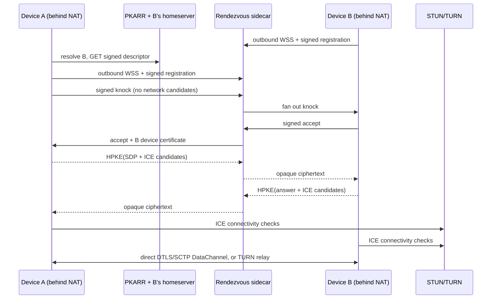

# Hole Punchky

Hole Punchky establishes an authenticated WebRTC DataChannel between two devices that know only each other's Pubky identity. Both devices may be behind NAT/firewalls. The target's existing Pubky homeserver publishes discovery data; a small public sidecar coordinates consent and encrypted ICE signaling; STUN performs UDP hole punching; TURN is the unavoidable fallback when a direct path cannot be formed.

The rendezvous service never receives plaintext SDP or ICE candidates. A Pubky root key delegates a short-lived device signing key and a separate X25519 encryption key. All signaling is sender-signed, recipient-encrypted with RFC 9180 HPKE, replay-bounded, and routed only after the target accepts a knock.



No homeserver fork is required. The descriptor is an ordinary file at:

```text
pubky://<identity>/pub/hole-punchky/v1/descriptor.json
```

The rendezvous server can run beside `pubky-homeserver`, behind the same reverse proxy, or as a shared independent service. See [architecture.md](docs/architecture.md) for the integration decision and [protocol.md](docs/protocol.md) for the normative wire protocol.

## What is implemented

- Root-signed device delegation using Pubky/PKARR Ed25519 identities.
- Separate device Ed25519 signing and X25519 HPKE encryption keys.
- RFC 8785 canonical JSON signatures with explicit domain separation.
- RFC 9180 base-mode HPKE using X25519/HKDF-SHA-256/ChaCha20-Poly1305.
- Signed Pubky discovery descriptors with expiry and endpoint priority.
- Automatic failover across verified descriptor endpoints in priority order.
- WebSocket rendezvous with registration replay defense, consent-first knocks, multi-device fan-out, first-accept binding, strict signal sequencing, bounded frames, rate limiting, and expiry.
- Session-scoped coturn REST credentials issued only after consent.
- Native Rust client using ICE, DTLS, SCTP, and binary/text WebRTC DataChannels.
- Direct-versus-relayed path reporting from the nominated local ICE candidate.
- Health, public configuration, and Prometheus metrics endpoints.
- Docker deployment for the sidecar and coturn.
- Unit, live-WebSocket, direct-ICE, TURN-only, CLI, and Pubky-testnet test paths.

## Quick local run

Rust 1.89+ is required.

```bash
cargo run -p hole-punchky -- init \
  --device-id laptop \
  --root-out root.key.json \
  --device-out laptop.key.json

export HPK_TURN_SHARED_SECRET="$(openssl rand -hex 32)"
docker compose -f deploy/docker-compose.yml up --build -d

cargo run -p hole-punchky -- descriptor \
  --root root.key.json \
  --rendezvous ws://127.0.0.1:8080/v1/ws \
  --out descriptor.json
```

For a two-device smoke test, issue a second identity/device in another directory. Run the listener with explicit demo consent:

```bash
cargo run -p hole-punchky -- listen \
  --device bob.key.json \
  --rendezvous ws://127.0.0.1:8080/v1/ws \
  --accept --echo --once
```

Then dial it using the printed Bob identity:

```bash
cargo run -p hole-punchky -- dial \
  --device alice.key.json \
  --peer <bob-z32-identity> \
  --rendezvous ws://127.0.0.1:8080/v1/ws \
  --message hello
```

`ws://` is intentionally accepted only for loopback. Public descriptors and clients require `wss://`.

## Publish discovery through Pubky

The Pubky identity must already have a homeserver account. Sign the descriptor with the same root, then publish it:

```bash
cargo run -p hole-punchky -- publish \
  --root root.key.json \
  --descriptor descriptor.json
```

Use `--testnet` with the local Pubky development environment. A new development identity can be registered first:

```bash
cargo run -p hole-punchky -- signup \
  --testnet \
  --root root.key.json \
  --homeserver <local-homeserver-z32-key>
```

Resolve independently with:

```bash
cargo run -p hole-punchky -- resolve --identity <z32-identity>
```

## Test

```bash
cargo fmt --all -- --check
cargo clippy --workspace --all-targets -- -D warnings
cargo test --workspace --all-targets
cargo audit
```

The TURN-only test is ignored unless coturn is available:

```bash
HPK_TEST_TURN_URL='turn:127.0.0.1:3478?transport=udp' \
HPK_TEST_TURN_SECRET='hole-punchky-integration-secret' \
cargo test -p hole-punchky-client forced_turn_path_relays_data_channel -- --ignored
```

See [testing.md](docs/testing.md) for container and network-isolation tests, [operations.md](docs/operations.md) for production deployment, and [threat-model.md](docs/threat-model.md) before exposing a service publicly.

## Workspace

- `hole-punchky-protocol`: interoperable wire types and cryptography.
- `hole-punchky-rendezvous`: payload-blind public rendezvous server and binary.
- `hole-punchky-client`: Pubky resolver and native WebRTC client.
- `hole-punchky`: operational CLI.

Licensed under the MIT License.
